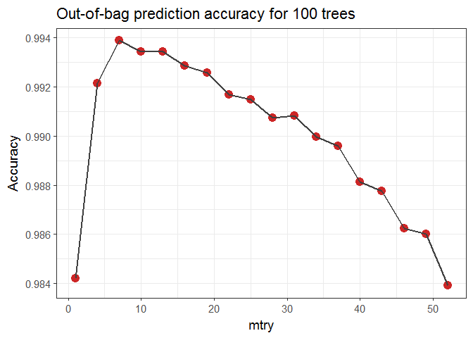
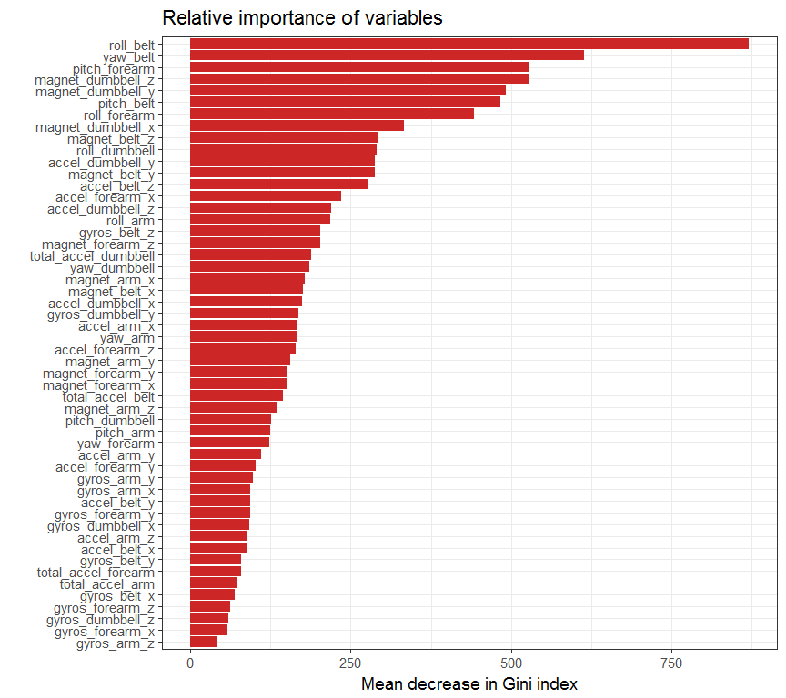

# Practical machine learning: classifying proper/incorrect execution of dumbbell curls
M. Ovaska  
2 April 2017  


# Summary
The goal of this study is to use data from sensors to classify whether
individuals are performing dumbbell curls correctly (class A), or in one
of four incorrect ways (classes B-E), such as throwing the elbows to the front or
lifting the dumbbell only halfway. The sensors were attached to the individuals'
arms, forearms, waist, and to the dumbbell. 

52 predictors are identified and selected, and a Random Forest algorithm is trained
on a set of 13737 training examples. The optimal number of variables considered
at each tree split (mtry) is determined by considering the out-of-bag error
for a range of values on forests of 100 trees. The final model is then trained
using 1000 trees. The overall misclassification error on a test set of 5885
observations is approximately 0.5%. 

For more information on the data, see the original paper: 
Velloso, E.; Bulling, A.; Gellersen, H.; Ugulino, W.; Fuks, H.
Qualitative Activity Recognition of Weight Lifting Exercises.
Proceedings of 4th International Conference in Cooperation with SIGCHI
(Augmented Human '13). Stuttgart, Germany: ACM SIGCHI, 2013.
http://groupware.les.inf.puc-rio.br/work.jsf?p1=11201


# Loading and preprocessing the data

First we load up the data and check for missing data (NA's, empty strings) etc. 
The goal is to find variables that are useful for training a machine learning 
algorithm.


```r
full_data <- read.csv("pml-training.csv", stringsAsFactors = FALSE)
dim(full_data)
```

```
## [1] 19622   160
```

```r
# Get number of NA's in numeric columns, and "" in character-type columns:
missing_data <- sapply(1:length(full_data), 
                       function(x){
                           if(is.numeric(full_data[, x])){
                               return(sum(is.na(full_data[, x])))
                           }
                           else if(is.character(full_data[, x])){
                               return(sum(full_data[, x] == ""))
                           }
                       })

table(missing_data)
```

```
## missing_data
##     0 19216 
##    60   100
```

100 variables consist mainly of missing data (19216/19622), while the
rest of the variables have all data present. Imputing is not sensible in this
case, so we remove the columns with any NA's or empty strings. We also drop the
first 7 columns, which contrain timestamps, identifiers etc. 


```r
remove_cols <- c(1:7, which(missing_data > 0))
data <- full_data[, -remove_cols]
names(data)
```

```
##  [1] "roll_belt"            "pitch_belt"           "yaw_belt"            
##  [4] "total_accel_belt"     "gyros_belt_x"         "gyros_belt_y"        
##  [7] "gyros_belt_z"         "accel_belt_x"         "accel_belt_y"        
## [10] "accel_belt_z"         "magnet_belt_x"        "magnet_belt_y"       
## [13] "magnet_belt_z"        "roll_arm"             "pitch_arm"           
## [16] "yaw_arm"              "total_accel_arm"      "gyros_arm_x"         
## [19] "gyros_arm_y"          "gyros_arm_z"          "accel_arm_x"         
## [22] "accel_arm_y"          "accel_arm_z"          "magnet_arm_x"        
## [25] "magnet_arm_y"         "magnet_arm_z"         "roll_dumbbell"       
## [28] "pitch_dumbbell"       "yaw_dumbbell"         "total_accel_dumbbell"
## [31] "gyros_dumbbell_x"     "gyros_dumbbell_y"     "gyros_dumbbell_z"    
## [34] "accel_dumbbell_x"     "accel_dumbbell_y"     "accel_dumbbell_z"    
## [37] "magnet_dumbbell_x"    "magnet_dumbbell_y"    "magnet_dumbbell_z"   
## [40] "roll_forearm"         "pitch_forearm"        "yaw_forearm"         
## [43] "total_accel_forearm"  "gyros_forearm_x"      "gyros_forearm_y"     
## [46] "gyros_forearm_z"      "accel_forearm_x"      "accel_forearm_y"     
## [49] "accel_forearm_z"      "magnet_forearm_x"     "magnet_forearm_y"    
## [52] "magnet_forearm_z"     "classe"
```

We end up with 52 numeric variables and the ```classe``` variable, which we want
to predict. We turn ```classe``` into a factor variable and separate the data
into a training set (70 %) and a test set (30 %).


```r
data$classe <- factor(data$classe)
library(caret)
set.seed(100)
inTrain <- createDataPartition(data$classe, p=0.7, list=FALSE)
training <- data[inTrain,]
testing <- data[-inTrain,]
```

# Training and testing a Random Forest algorithm

We use the Random Forest algorithm in the ```randomForest``` package through the 
```caret``` package's ```train``` function. The main tunable parameters are the
number of trees to
train (typically more is better, but it takes more time), and the number of
variables that are considered for each split in a tree, labeled ```mtry```. 
For classification problems with $N$ variables, a typical value is 
mtry = $\sqrt N$. We scan the range ```mtry=1,4,7,...,52``` for trees of
size ```ntree=100``` to find the optimal value. For a random forest, we can
use the out-of-bag error ("oob") instead of normal cross-validation to assess
the model performance during training.


```r
set.seed(100)
rfGrid <- expand.grid(mtry=seq(1,52,3))
trCont <- trainControl(method="oob")
rfModel <- train(classe~., data=training, method="rf", tuneGrid=rfGrid,
               ntree=100, trControl=trCont)
rfModel
```

```
## Random Forest 
## 
## 13737 samples
##    52 predictor
##     5 classes: 'A', 'B', 'C', 'D', 'E' 
## 
## No pre-processing
## Resampling results across tuning parameters:
## 
##   mtry  Accuracy   Kappa    
##    1    0.9842032  0.9800130
##    4    0.9921380  0.9900544
##    7    0.9938851  0.9922652
##   10    0.9934484  0.9917124
##   13    0.9934484  0.9917127
##   16    0.9928660  0.9909755
##   19    0.9925748  0.9906070
##   22    0.9917012  0.9895028
##   25    0.9914829  0.9892260
##   28    0.9907549  0.9883050
##   31    0.9908277  0.9883970
##   34    0.9899541  0.9872916
##   37    0.9895902  0.9868319
##   40    0.9881342  0.9849898
##   43    0.9877703  0.9845289
##   46    0.9862415  0.9825950
##   49    0.9860231  0.9823185
##   52    0.9839121  0.9796479
## 
## Accuracy was used to select the optimal model using  the largest value.
## The final value used for the model was mtry = 7.
```


```r
library(ggplot2)
ggplot(data=rfModel$results, aes(x=mtry, y=Accuracy)) +
    geom_point(size=4, col="firebrick3") + 
    geom_path(lwd=1, col="grey25") + 
    ggtitle("Out-of-bag prediction accuracy for 100 trees") + 
    theme_bw(base_size=14)
```

<!-- -->

The optimal value is found to be ```mtry=7```, although there is little difference
between this and the adjacent values. Finally we train one larger forest with
```ntree=1000``` and test this with the test set that we haven't touched yet.


```r
set.seed(100)
rfGrid <- expand.grid(mtry=c(7))
trCont <- trainControl(method="oob")
rfModelFinal <- train(classe~., data=training, method="rf", tuneGrid=rfGrid,
               ntree=1000, trControl=trCont)

confusionMatrix(testing$classe, predict(rfModelFinal, testing))
```

```
## Confusion Matrix and Statistics
## 
##           Reference
## Prediction    A    B    C    D    E
##          A 1673    1    0    0    0
##          B    6 1133    0    0    0
##          C    0    3 1021    2    0
##          D    0    0    9  954    1
##          E    0    0    3    0 1079
## 
## Overall Statistics
##                                           
##                Accuracy : 0.9958          
##                  95% CI : (0.9937, 0.9972)
##     No Information Rate : 0.2853          
##     P-Value [Acc > NIR] : < 2.2e-16       
##                                           
##                   Kappa : 0.9946          
##  Mcnemar's Test P-Value : NA              
## 
## Statistics by Class:
## 
##                      Class: A Class: B Class: C Class: D Class: E
## Sensitivity            0.9964   0.9965   0.9884   0.9979   0.9991
## Specificity            0.9998   0.9987   0.9990   0.9980   0.9994
## Pos Pred Value         0.9994   0.9947   0.9951   0.9896   0.9972
## Neg Pred Value         0.9986   0.9992   0.9975   0.9996   0.9998
## Prevalence             0.2853   0.1932   0.1755   0.1624   0.1835
## Detection Rate         0.2843   0.1925   0.1735   0.1621   0.1833
## Detection Prevalence   0.2845   0.1935   0.1743   0.1638   0.1839
## Balanced Accuracy      0.9981   0.9976   0.9937   0.9979   0.9992
```

The overall misclassification error on the test set is approximately 0.5 %.
Let's have a look at the most important variables, with respect to the decrease
in Gini index:


```r
importance <- as.data.frame(rfModelFinal$finalModel$importance)
importance$variable <- rownames(importance)
ggplot(data=importance, aes(x=reorder(variable, MeanDecreaseGini), y=MeanDecreaseGini)) +
    geom_col(fill="firebrick3") +
    coord_flip() +
    xlab("") +
    ylab("Mean decrease in Gini index") +
    ggtitle("Relative importance of variables") +
    theme_bw(base_size = 14)
```

<!-- -->

Finally we can also predict the class of the 20 additional testing cases:


```r
final_testing <- read.csv("pml-testing.csv", stringsAsFactors = FALSE)
final_testing <- final_testing[, -remove_cols]
predict(rfModelFinal, final_testing)
```

```
##  [1] B A B A A E D B A A B C B A E E A B B B
## Levels: A B C D E
```


